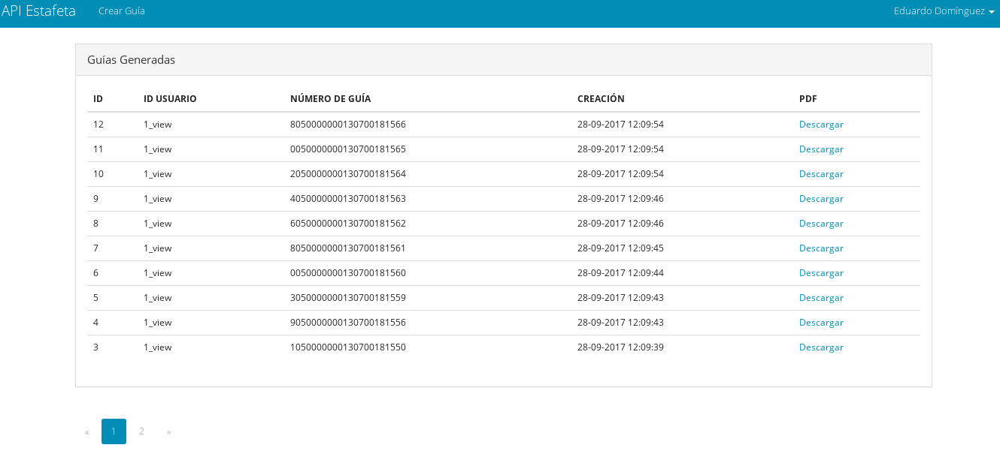

    Copyright © Ing. Eduardo Domínguez García

## Acerca de la API

Fue creada en Laravel el cual es un framework de código abierto para desarrollar aplicaciones y servicios web con PHP 7.0, ya que la version de esta API esta en Laravel 5.5. Su filosofía de Larael es desarrollar código PHP de forma elegante y simple, evitando el "código espagueti".

Contiene:

- [Motor simple y rápido de enrutamiento](https://laravel.com/docs/routing).
- [Potente contenedor de inyección de dependencia](https://laravel.com/docs/container).
- Múltiples back-ends para [sesión](https://laravel.com/docs/session) and [cache](https://laravel.com/docs/cache) storage.
- Expressive, intuitive [database ORM](https://laravel.com/docs/eloquent).
- Expressivo, intuitivo [base de datos ORM](https://laravel.com/docs/migrations).
- [Procesamiento robusto de trabajo en segundo plano](https://laravel.com/docs/queues).
- [Transmisión de eventos en tiempo real](https://laravel.com/docs/broadcasting).

- API creada: Registro de base de datos para las guias generadas.
- API creada: Login, registro, recuperacion de contraseña, para el logeo de usuarios.
- API creada: Base de Datos (eloquent) .
- API creada: Paginación de Resultados.

- API creada: Formulario para la creación de Guia.

